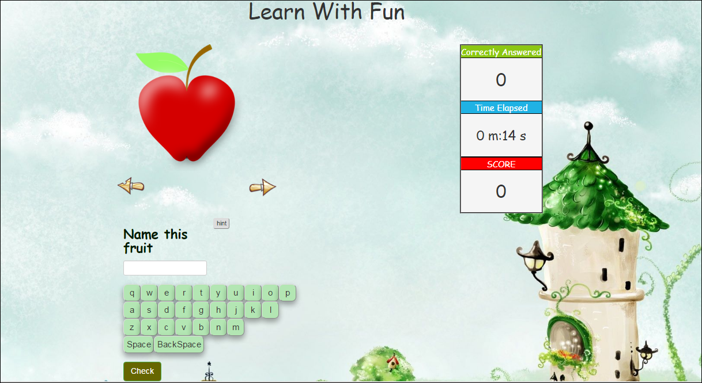
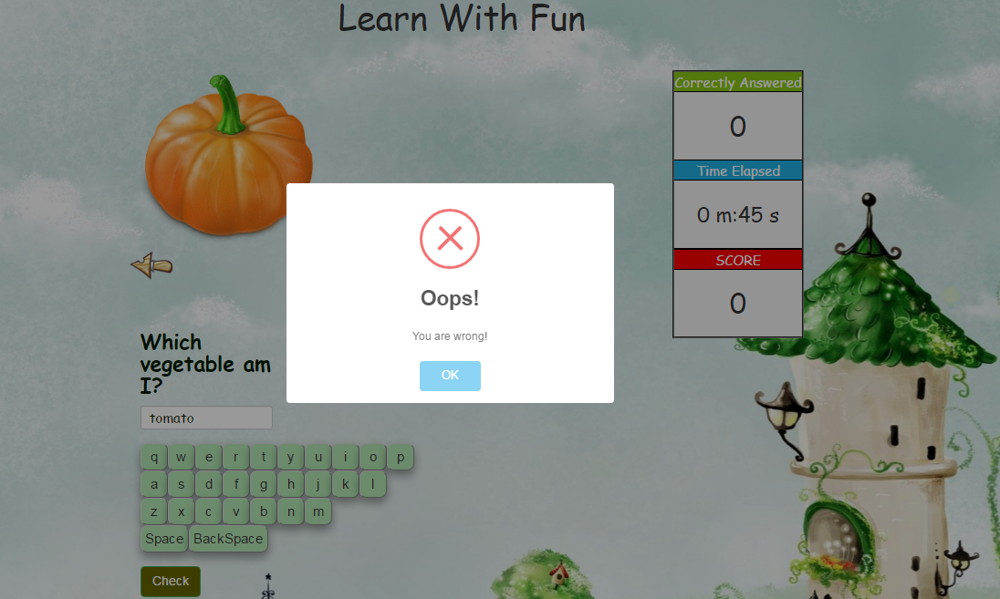
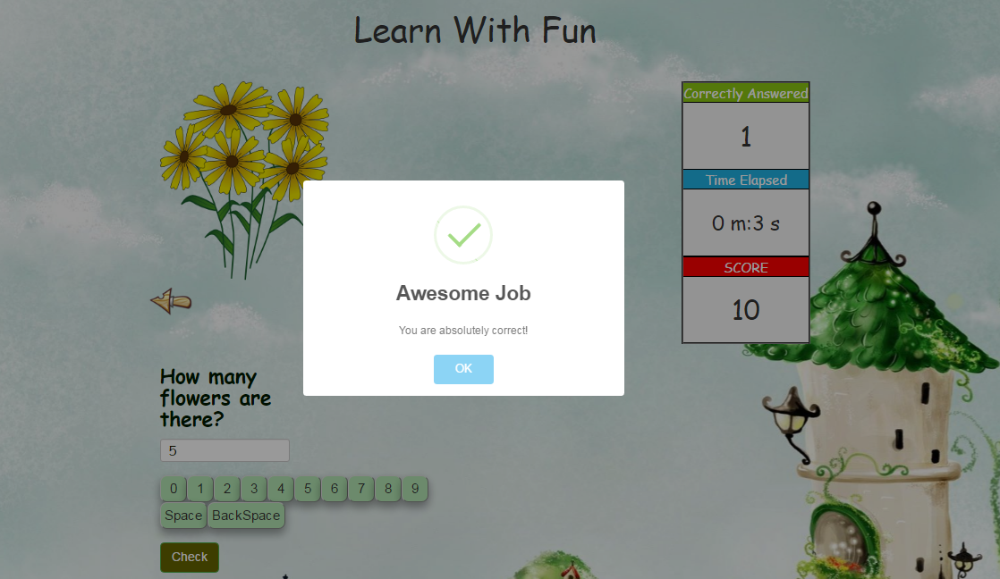

# Learn-With-Fun
A web application built with JavaScript,Jquery and BootStrap. Now learning is not boring anymore. So buckle up and learn with fun!
Interactive Learning has evolved out of the hyper-growth in the use of digital technology and virtual communication, particularly by students. Beginning around 2000, students entering institutes of higher education have expected that interactive learning will be an integral part of their education. The use of interactive technology in learning for these students is as natural as using a pencil and paper were to past generations.

This is a kind of a quiz app built with an awesome interactive interface. This version is designed specially for kids who have just started where they can discover a whole new world for learning. 
To start evaluating yourself click on  http://tub99.github.io/LearnWithFun/index.html

</img>

Through this app the user can evaluate himself/herself and check how he/she is performing

</img>

Self-evaluation is the key aspect of this web-app. In the coming version we will also give comparative studies so that the user can see wherer he/she stands amognst other competitors.

</img>

